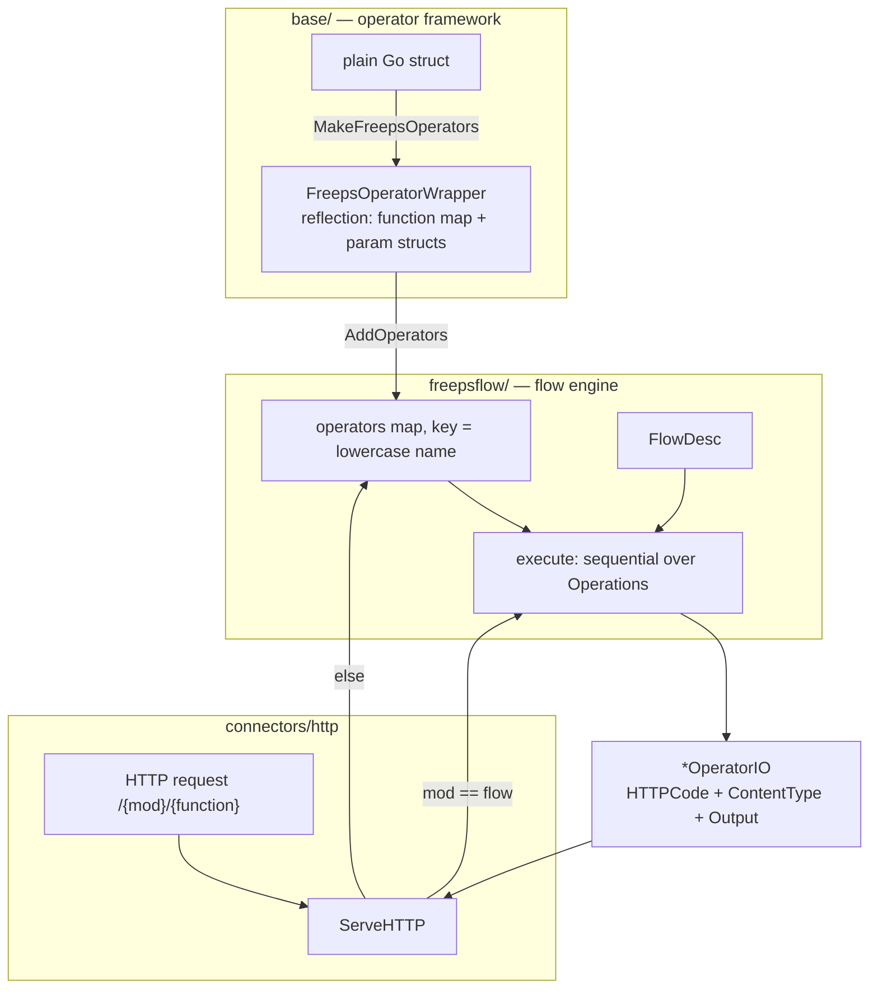

# Architecture

The shape of these three layers is driven by the [design principles](../design-principles.md):
reflection instead of code generation, one route instead of a router, and no auth layer.

Three layers, from bottom to top:



## base/ — the operator framework

`base.FreepsOperator` is an **empty marker interface**. Everything else is reflection:

`MakeFreepsOperators(op, cr, ctx)` (`base/operatorImpl.go`) walks the exported methods of the
struct with `reflect` and keeps the ones whose signature matches one of the `FreepsFunctionType`
shapes. All of them return exactly one `*base.OperatorIO`:

| Shape | Signature |
|---|---|
| Simple | `()` |
| ContextOnly | `(ctx)` |
| ContextAndInput | `(ctx, input)` |
| WithDynamicFunctionArguments | `(ctx, input, args FunctionArguments)` |
| WithArguments | `(ctx, input, args SomeArgsStruct)` |
| FullSignature | `(ctx, input, args SomeArgsStruct, otherArgs FunctionArguments)` |

An operator with **no** matching method is silently skipped — a typo in a signature means the
function quietly does not exist.

**Naming.** `GetName()` takes the struct type name and strips a leading `Op` or `Operator`:
`OpFlowBuilder` → `flowbuilder`, `OpStore` → `store`. The flow engine lowercases it. If the
operator is a config variation, the name is the config section name instead (e.g. `http.internal`).

**Parameters.** A parameter struct field becomes an argument:

| Field | Meaning |
|---|---|
| `Name string` | required argument, name `name` |
| `Name *string` | optional |
| `Name []string` | repeatable |
| `Name int64` | accepts a plain integer **or** a Go duration string (`30s`, `5m`) — it is the conventional type for durations |
| ``json:"other"`` | alternative argument name |
| ``doc:"..."`` | human-readable description of the argument, **optional** — see `DescribeArguments` |

Missing required fields produce a 400 automatically.

**Argument descriptions.** `base.DescribeArguments(op, fn)` returns name, type, requiredness
and the `doc` tag for every argument of a function. The tag is optional and arguments without
it are described by name only, so descriptions can be added incrementally. Args structs are
shared between functions (`StoreGetSetEqualArgs` serves seven store functions); if an argument
means something different per function, either say so in the tag or split the struct.

**Capability interfaces** — implement to opt into behaviour:

| Interface | Gives you |
|---|---|
| `FreepsOperatorWithConfig` | `GetDefaultConfig()` + `InitCopyOfOperator()` — config section is read, defaults written back, multiple instances via `name.suffix` sections, `"enabled": false` skips it |
| `FreepsOperatorWithDynamicFunctions` | `ExecuteDynamic()` and friends — invent function names at runtime (the store uses this) |
| `FreepsOperatorWithShutdown` | `StartListening()` / `Shutdown()` — called by the engine at startup/exit |
| `FreepsOperatorWithHook` | `GetHook()` — receive engine callbacks |
| `FreepsFunctionParametersWithInit` | `Init(ctx, op, fn)` on a parameter struct — default values |

**`OperatorIO`** (`base/operatorio.go`) is the universal value type: `OutputType`
(error/plain/byte/object/integer/floating/empty), `HTTPCode`, `Output`, `ContentType`. Operators
set the HTTP status themselves via `MakeOutputError(404, ...)`, `MakeObjectOutput(...)` and so on.
This is what lets the same function serve HTTP, a CLI call and a flow step without knowing which.

**`Context`** (`base/context.go`) carries a UUID, a reason string, a Go `context.Context` and a
scoped logger. `ChildContextWithField` derives children; the UUID is echoed back as
`X-Freeps-ID`.

## The dynamic REST API

There is exactly one router and one handler in the codebase (`connectors/http/http.go`):

```go
r.HandleFunc("/{mod}/{function}", rest)   // plus trailing-slash and /{device} variants
```

`ServeHTTP` calls `ExecuteOperatorByName(ctx, vars["mod"], vars["function"], args, input)`, except
for `mod == "flow"`, which calls `ExecuteFlow`. Adding an endpoint therefore means *writing a
method* — no registration step exists.

`ExecuteOperatorByName` wraps the call in a one-operation ad-hoc flow
(`{Operator, Function, UseMainArgs: true, InputFrom: "_"}`), so a single operator call and a flow
go through the same code path.

The HTTP server is started by `OpCurl.StartListening` — the client-side curl operator doubles as
the lifecycle owner of the server. `FlowEngine.StartListening` iterates all operators and calls
`StartListening` on each.

## freepsflow/ — the flow engine

See [user/flows.md](../user/flows.md) for the user-facing view. Internally:

- `FlowDesc` is the declarative form; `Flow` is a runtime instance created per execution by
  `NewFlow`, which calls `GetCompleteDesc` to validate and fill in defaults.
- `GetCompleteDesc` (`flowDesc.go`) is the **only** validation: non-empty operations, no duplicate
  or reserved names, every referenced operator exists, and every reference
  (`InputFrom`/`ArgumentsFrom`/`ExecuteOnSuccessOf`/`ExecuteOnFailOf`/`OutputFrom`) points to an
  operation defined *earlier* in the array. Variable interpolation `${...}` is **not** checked.
- Execution (`Flow.executeSync`) is a plain `for` loop over `Operations`, storing each output in
  `opOutputs[name]`. Errors short-circuit: an operation whose `InputFrom` errored is skipped and
  the error propagates.
- Timeouts are per-operation and per-flow, taken from the `operationTimeout` / `flowTimeout` tags.

**Registration and persistence.** `AddFlow` validates, fires flow-changed hooks, and writes
`<config dir>/graphs/<flowID>.json` via `ConfigReader.WriteObjectToFile`, which first renames the
previous file to `<name>.json.<unix-ts>.bak`. `DeleteFlow` removes both the map entry and the file.
At startup `loadStoredAndEmbeddedFlows` reads the embedded flows and then every `graphs/*.json`;
the flow ID is the filename without extension, and a name collision is skipped with a warning.

**Triggers.** `ExecuteFlowByTagsExtended(ctx, tagGroups, args, input)` selects flows whose tags
satisfy every group (each group is an OR of alternatives) and runs them. Connectors call this when
events arrive. If more than one flow matches, a temporary flow is synthesized that chains
`{Operator: "flow", Function: <id>}` per match.

**Hooks.** `FlowEngineHook` is a name-only marker; the engine then type-asserts for optional
interfaces — `FreepsExecutionHook` (`OnExecute`, `OnExecuteOperation`, `OnExecutionFinished`),
`FreepsFlowChangedHook` (`OnFlowChanged`), `FreepsAlertHook`. Registered operators' hooks are
called automatically; a panic in a hook is recovered and turned into an alert.

## Storage

`connectors/store` is a namespaced key/value store used both by users and internally. Namespaces
starting with `_` are internal and created on demand: `_flows`, `_sensors`, `_alerts`, `_mqtt`,
`_influx`, `_smtp`, `_pixeldisplay`, `_files`, `_debug`, `_execution_log`, `_context`.

Backends are chosen per namespace in the `store` config section: `memory` (the default for any
namespace not listed), `files`, `postgres` (build tag `nopostgres` removes it), and `log`.

This is why **`_flows` drafts do not survive a restart** unless configured as `files` — see
[user/flows.md](../user/flows.md#storing-flows).

## Startup sequence

`freepsd/freepsd.go`:

1. read config, configure logging
2. `NewFlowEngine` — registers the built-in `flow`, `flowbytag`, `system` operators and loads flows
3. build the hard-coded `availableOperators` slice and register each through
   `MakeFreepsOperators` (config-disabled ones are skipped). **Order matters**: store first, then
   alerts, then influx, then sensors — later operators use the earlier ones
4. add the `ui` operator directly (it bypasses config enable/disable) and the `exec` operators
5. if `-m` was given, execute one operator, write the output to stdout, exit
6. otherwise `StartListening` and block until a listener cancels the context; if the cancel was a
   `system/reload`, `main()` loops and rebuilds everything

## The UI

`connectors/ui` is a `text/template` renderer over the same engine. Every template file is also an
operator function, so `/ui/<template>` renders it. Templates can be overridden per installation by
placing a file of the same name in `<config dir>/templates/`, which the UI can itself edit and
delete (`editTemplate` / `deleteTemplate`).

The flow editor is a single self-submitting form: the whole current `FlowDesc` travels in a hidden
`FlowJSON` field, each button is one form field (`newOp`, `deleteOp`, `op`, `fn`, `arg.<name>`, …),
and `buildPartialFlow` applies that delta to the flow. "Save" calls `AddFlow`, "Save temp" stores a
draft, "Execute" runs the draft ad hoc and points an iframe at the result.
